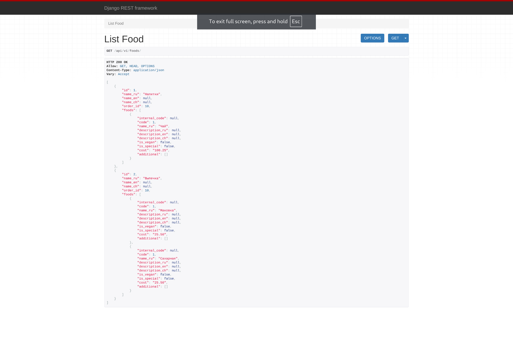

# utf-django-test-task
DRF test task for the position of Junior Django Developer.  
Фетчит данные БД в следующем формате по URL `127.0.0.1:8000/api/v1/foods/`:
```json
[
      {
         "id":1,
         "name_ru":"Напитки",
         "name_en":null,
         "name_ch":null,
         "order_id":10,
         "foods":[
            {
               "internal_code":100,
               "code":1,
               "name_ru":"Чай",
               "description_ru":"Чай 100 гр",
               "description_en":null,
               "description_ch":null,
               "is_vegan":false,
               "is_special":false,
               "cost":"123.00",
               "additional":[
                  200
               ]
            },
            {
               "internal_code":200,
               "code":2,
               "name_ru":"Кола",
               "description_ru":"Кола",
               "description_en":null,
               "description_ch":null,
               "is_vegan":false,
               "is_special":false,
               "cost":"123.00",
               "additional":[
                  
               ]
            },
            {
               "internal_code":300,
               "code":3,
               "name_ru":"Спрайт",
               "description_ru":"Спрайт",
               "description_en":null,
               "description_ch":null,
               "is_vegan":false,
               "is_special":false,
               "cost":"123.00",
               "additional":[
                  
               ]
            },
            {
               "internal_code":400,
               "code":4,
               "name_ru":"Байкал",
               "description_ru":"Байкал",
               "description_en":null,
               "description_ch":null,
               "is_vegan":false,
               "is_special":false,
               "cost":"123.00",
               "additional":[
                  
               ]
            }
         ]
      },
      {
         "id":2,
         "name_ru":"Выпечка",
         "name_en":null,
         "name_ch":null,
         "order_id":20,
         "foods":[...]
      },
      {...},
      {...}
   ]
```
Для всех инстанций `Food`, имеющих `True` в поле `is_publish`.  
При возникновении конфликта версий следует обратиться к `requirements.txt`:
```bash
pip install -r requirements.txt
```
Использованная версия Python: 3.13.2  

Демо:
